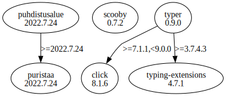

# Third Party Dependencies

<!--[[[fill sbom_sha256()]]]-->
The [SBOM in CycloneDX v1.4 JSON format](https://git.sr.ht/~sthagen/kiirastuli/blob/default/etc/sbom/cdx.json) with SHA256 checksum ([2d8a0574 ...](https://git.sr.ht/~sthagen/kiirastuli/blob/default/etc/sbom/cdx.json.sha256 "sha256:2d8a0574236419a40cc4c4fb6f3caad97914f697a5071a61050d595a1eba935b")).
<!--[[[end]]] (checksum: 0e186e361c1e6b19776cc9f8d6998af7)-->
## Licenses 

JSON files with complete license info of: [direct dependencies](direct-dependency-licenses.json) | [all dependencies](all-dependency-licenses.json)

### Direct Dependencies

<!--[[[fill direct_dependencies_table()]]]-->
| Name                                                      | Version                                                        | License     | Author                                                              | Description (from packaging data)                                                                                                     |
|:----------------------------------------------------------|:---------------------------------------------------------------|:------------|:--------------------------------------------------------------------|:--------------------------------------------------------------------------------------------------------------------------------------|
| [puhdistusalue](https://git.sr.ht/~sthagen/puhdistusalue) | [2022.7.24](https://pypi.org/project/puhdistusalue/2022.7.24/) | MIT License | Stefan Hagen                                                        | Puhdistusalue (Finnish for clean area here meaning purge range) - Purge monotonically named files in folders keeping range endpoints. |
| [scooby](https://github.com/banesullivan/scooby)          | [0.9.2](https://pypi.org/project/scooby/0.9.2/)                | MIT License | Dieter Werthmüller, Bane Sullivan, Alex Kaszynski, and contributors | A Great Dane turned Python environment detective                                                                                      |
| [typer](https://github.com/tiangolo/typer)                | [0.9.0](https://pypi.org/project/typer/0.9.0/)                 | MIT License | Sebastián Ramírez                                                   | Typer, build great CLIs. Easy to code. Based on Python type hints.                                                                    |
<!--[[[end]]] (checksum: 258ee3bfc5b483e7cffd393097f4a94a)-->

### Indirect Dependencies

<!--[[[fill indirect_dependencies_table()]]]-->
| Name                                            | Version                                                   | License     | Author                                | Description (from packaging data)                                                        |
|:------------------------------------------------|:----------------------------------------------------------|:------------|:--------------------------------------|:-----------------------------------------------------------------------------------------|
| [click](https://palletsprojects.com/p/click/)   | [8.1.6](https://pypi.org/project/click/8.1.6/)            | BSD License | Pallets <contact@palletsprojects.com> | Composable command line interface toolkit                                                |
| [puristaa](https://git.sr.ht/~sthagen/puristaa) | [2022.7.24](https://pypi.org/project/puristaa/2022.7.24/) | MIT License | Stefan Hagen                          | Puristaa (Finnish for compress) - shared prefix compression of ordered string sequences. |
<!--[[[end]]] (checksum: 1c8887d2dcd652543a47a4ceefbfa84e)-->

## Dependency Tree(s)

JSON file with the complete package dependency tree info of: [the full dependency tree](package-dependency-tree.json)

### Rendered SVG

Base graphviz file in dot format: [Trees of the direct dependencies](package-dependency-tree.dot.txt)



### Console Representation

<!--[[[fill dependency_tree_console_text()]]]-->
````console
puhdistusalue==2022.7.24
└── puristaa [required: >=2022.7.24, installed: 2022.7.24]
scooby==0.9.2
typer==0.9.0
├── click [required: >=7.1.1,<9.0.0, installed: 8.1.6]
└── typing-extensions [required: >=3.7.4.3, installed: 4.7.1]
````
<!--[[[end]]] (checksum: 84dcbbad2d76457e23be3a074a6a7448)-->
